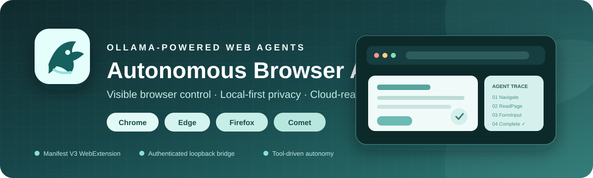
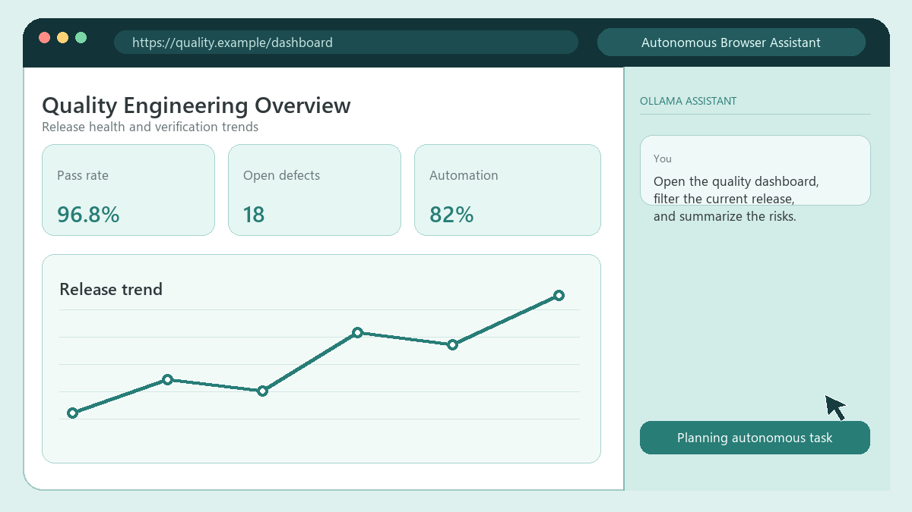

<div align="center">
  
</div>

<h1 align="center">Autonomous Browser Automation</h1>

<p align="center">
  <strong>Give local or Ollama Cloud models a visible, safety-gated browser they can actually operate.</strong>
  <br>
  Persistent side-panel chat · Semantic page understanding · Multi-step tool execution · Image and document inputs
</p>

<p align="center">
  <a href="https://github.com/Lev0n82/AutonomousBrowserAutomation/releases">
    
  </a>
  <a href="LICENSE">
    
  </a>
  <a href="https://github.com/Lev0n82/AutonomousBrowserAutomation/stargazers">
    
  </a>
  <a href="https://github.com/Lev0n82/AutonomousBrowserAutomation/releases">
    
  </a>
</p>

<p align="center">
  
  
  
  
  
  
  
</p>

<p align="center">
  
  
  
  
</p>

<p align="center">
  <a href="https://github.com/Lev0n82/AutonomousBrowserAutomation/releases/download/v0.2.1/AutonomousBrowserAutomation-Chromium-v0.2.1.zip"><strong>Download Chrome / Edge</strong></a>
  &nbsp;·&nbsp;
  <a href="https://github.com/Lev0n82/AutonomousBrowserAutomation/releases/download/v0.2.1/AutonomousBrowserAutomation-Firefox-v0.2.1.zip"><strong>Download Firefox</strong></a>
  &nbsp;·&nbsp;
  <a href="#quick-start-on-windows"><strong>Quick start</strong></a>
  &nbsp;·&nbsp;
  <a href="#security-and-privacy"><strong>Security</strong></a>
</p>

---

<table>
  <tr>
    <td align="center"><strong>4</strong><br><sub>browser experiences</sub></td>
    <td align="center"><strong>6</strong><br><sub>model tool families</sub></td>
    <td align="center"><strong>11</strong><br><sub>interaction primitives</sub></td>
    <td align="center"><strong>2</strong><br><sub>Ollama runtimes</sub></td>
    <td align="center"><strong>∞</strong><br><sub>steps until cancel</sub></td>
  </tr>
</table>

### See the agent workflow

<div align="center">
  
  <br>
  <sub><em>Illustrative project animation: plan → navigate → read → interact → capture → summarize.</em></sub>
</div>

### What it can operate

`Navigate` · `ReadPage` · `GetPageText` · `TabsCreate` · `FormInput` ·
`Click` · `Right-click` · `Double-click` · `Type` · `Press keys` · `Scroll` ·
`Drag` · `Screenshot` · `Wait`

| Execution mode | Where inference runs | Browser-control path | Best fit |
|---|---|---|---|
| **Local Ollama** | Your machine at `127.0.0.1:11434` | WebExtension or native Comet agent | Private workflows, offline use, controlled data |
| **Ollama Cloud** | Ollama Cloud API | Same browser tools and safety gates | Faster/larger models and complex multi-step planning |

### Recommended model starting points

These are practical starting points observed during development, not universal
benchmarks. Model availability and capabilities can change.

| Mode | Model | Recommended for | Guidance |
|---|---|---|---|
| Local · lightweight | `granite4.1:3b` | Basic tool execution on modest hardware | Tool capable; smaller models may need simpler, more explicit tasks |
| Local · balanced | `qwen3.5` | Stronger planning and multi-step browser work | Choose a size appropriate for available RAM/VRAM |
| Cloud · fast | `glm-5.3-flash:cloud` | Responsive interactive browsing | Verified through Ollama Cloud during development |
| Cloud · tested | `glm-5.1` | Long-form research and document-assisted tasks | Used for the current attachment and agent round-trip validation |
| Vision workflows | Any model exposing **tools + vision** | Screenshots and pasted images | Confirm both capabilities before relying on visual inputs |

> [!IMPORTANT]
> **What is the bridge token?** It is a random local-session secret used only to
> authorize the extension and assistant against `127.0.0.1:11435`. The launcher
> generates it automatically at `%LOCALAPPDATA%\OllamaComet\bridge.token`.
> Installed Chrome/Edge launchers inject it automatically; manual ZIP users copy
> it into extension settings. It is **not** an Ollama Cloud API key. Never share
> or commit it.

> [!NOTE]
> **Public preview:** Comet is the most extensively exercised path. Chrome and
> Edge use the shared independent WebExtension; Firefox currently uses semantic
> DOM-event fallbacks for Chromium-only debugger actions.

## What this project does

Autonomous Browser Automation combines:

1. An assistant interface that runs in a browser side panel or sidebar.
2. A loopback-only bridge that connects the browser to local Ollama or Ollama
   Cloud models.
3. An agent loop that lets tool-capable models inspect pages, navigate tabs,
   enter values, click controls, scroll, capture screenshots, and continue until
   a task is complete or the user cancels it.
4. Safety gates that require explicit confirmation before sensitive actions
   such as submitting forms, sending messages, purchasing, deleting, downloading,
   entering credentials, or changing accounts.

The browser remains visible while actions execute. The conversation stays in
the assistant panel, and normal navigation occurs in the main browser area.

## Supported browsers

| Browser | Assistant surface | Action implementation | Launch command |
|---|---|---|---|
| Google Chrome | Chrome side panel | WebExtension APIs plus DevTools debugger input | `ollama launch chrome` |
| Chromium / custom instance | Chromium side panel | Manually loaded WebExtension | `ollama launch chromium --bridge-only` |
| Microsoft Edge | Edge side panel | WebExtension APIs plus DevTools debugger input | `ollama launch edge` |
| Mozilla Firefox | Firefox sidebar | WebExtension APIs plus semantic DOM-event fallbacks | Manual extension load |
| Perplexity Comet | Native Comet sidecar | Signed Comet Agent `/agent` protocol | `ollama launch comet` |

Chrome and Edge share the Chromium extension package. Firefox uses a separate
Manifest V3 package because Firefox implements sidebars and background scripts
differently.

## Capabilities

- Local Ollama and direct Ollama Cloud model selection
- Persistent responsive assistant with pastel-teal neutral styling
- Unlimited autonomous tool steps until completion or cancellation
- Markdown responses, including tables and code blocks
- Pasted or uploaded image inputs for vision-capable models
- Local PDF, DOCX, and XLSX text extraction
- Visible tab navigation and new-tab creation
- Semantic page reading with stable element references
- Form input, click, double-click, right-click, typing, keys, scrolling, drag,
  screenshot, and wait actions
- Context compaction and screenshot omission to prevent model-context overflow
- Windows DPAPI protection for the Ollama Cloud API key

## Architecture

```text
Browser side panel/sidebar
        |
        | authenticated loopback HTTP
        v
Python bridge on 127.0.0.1:11435
        |
        +---- Ollama local: http://127.0.0.1:11434
        |
        +---- Ollama Cloud: https://ollama.com/api
        |
        +---- Browser command broker
                 |
                 +---- Chrome / Edge / Firefox WebExtension
                 |
                 +---- Comet signed native agent fallback
```

When Chrome, Edge, or Firefox is actively polling the bridge, browser tools are
routed to that extension. If no independent extension is connected, the
`OllamaComet` branch can fall back to Comet's signed native agent.

## Quick start on Windows

### Prerequisites

- Windows 10 or 11
- [Ollama](https://ollama.com/download)
- Python 3
- At least one supported browser
- A tool-capable Ollama model

### Install the launcher

Clone this branch and run:

```powershell
git clone --branch OllamaComet https://github.com/Lev0n82/AutonomousBrowserAutomation.git
cd AutonomousBrowserAutomation
.\Install-AutonomousBrowserAutomation.ps1
```

To configure an exact browser executable or installation folder during setup:

```powershell
.\Install-AutonomousBrowserAutomation.ps1 `
  -Browser chromium `
  -BrowserPath "C:\Tools\Chromium"
```

The installer accepts either the executable itself or its installation folder,
validates it, and stores the resolved path in
`%LOCALAPPDATA%\AutonomousBrowserAutomation\browser-paths.json`. Future
`ollama launch chromium` commands use that executable automatically. Repeat the
command with `chrome` or `edge` to configure those browsers.

The installer:

- Builds the Chromium extension.
- Copies the bridge, launcher, wrapper, and extension into
  `%LOCALAPPDATA%\AutonomousBrowserAutomation\bin`.
- Installs Python dependencies if they are missing.
- Places the wrapper first in the current user's `PATH`.
- Stops an older bridge process so the updated bridge starts on the next launch.

Open a new terminal after installation.

### Launch

```powershell
ollama launch chrome
ollama launch chromium
ollama launch edge
ollama launch comet
```

Select a specific model:

```powershell
ollama launch chrome --model qwen3.5
ollama launch edge --model glm-5.3-flash:cloud
ollama launch comet --model granite4.1:3b
```

Configure local or cloud mode:

```powershell
ollama launch chrome --config
```

Configuration is shared by all three launch commands. Other Ollama commands are
forwarded unchanged to the official `ollama.exe`.

The installer adds an idempotent PowerShell function that routes `ollama`
through the project wrapper. In an already-open PowerShell window, refresh it:

```powershell
. $PROFILE.CurrentUserAllHosts
```

### Connect an existing Chromium instance

If you already loaded the extension into a specific Chromium profile, do not
launch another browser. Start only the bridge:

```powershell
ollama launch chromium --bridge-only
```

Then open **Autonomous Browser Assistant → Extension options** and set:

- Bridge URL: `http://127.0.0.1:11435`
- Bridge token: copy the contents of
  `%LOCALAPPDATA%\OllamaComet\bridge.token`

Open the extension side panel. The background extension begins polling the
bridge and browser actions execute in the active Chromium tab.

The bridge token remains required as a loopback authorization secret. The
launcher generates it and writes it to the installed extension configuration;
it is not an Ollama API key. Removing this check would allow unrelated local
pages or processes to submit browser-control requests to the bridge.

To launch a specific Chromium executable instead:

```powershell
ollama launch chromium --browser-path "C:\path\to\chromium.exe"
```

### Chrome and Edge first launch

The launcher opens an isolated browser profile. On its first launch it also
opens the browser's extensions page and prints the exact extension directory.

Official branded Chrome and Edge builds no longer accept command-line unpacked
extension installation. Complete this one-time setup:

1. Enable **Developer mode**.
2. Select **Load unpacked**.
3. Choose `%LOCALAPPDATA%\AutonomousBrowserAutomation\bin\browser-extension`.
4. Pin **Autonomous Browser Assistant**.
5. Select its toolbar icon to open the side panel.

The isolated profile remembers the extension on later launches.

The launcher writes the current bridge URL and random session token only into
the installed unpacked extension directory. It is not committed to Git.

## Install a release ZIP manually

### Chrome or Edge

1. Download and extract the
   [Chromium ZIP](https://github.com/Lev0n82/AutonomousBrowserAutomation/releases/download/v0.2.1/AutonomousBrowserAutomation-Chromium-v0.2.1.zip).
2. Open `chrome://extensions` or `edge://extensions`.
3. Enable **Developer mode**.
4. Select **Load unpacked**.
5. Choose the extracted directory containing `manifest.json`.
6. Open extension settings and enter:
   - Bridge URL: `http://127.0.0.1:11435`
   - Bridge token: `%LOCALAPPDATA%\OllamaComet\bridge.token`

### Firefox

1. Download and extract the
   [Firefox ZIP](https://github.com/Lev0n82/AutonomousBrowserAutomation/releases/download/v0.2.1/AutonomousBrowserAutomation-Firefox-v0.2.1.zip).
2. Open `about:debugging#/runtime/this-firefox`.
3. Select **Load Temporary Add-on**.
4. Choose the extracted `manifest.json`.
5. Open the add-on settings and configure the bridge URL and token.
6. Open the Firefox sidebar and select **Autonomous Browser Assistant**.

Temporary Firefox add-ons are removed when Firefox closes. A signed AMO package
is planned after broader compatibility testing.

## Example prompts

```text
Open example.com in the main browser area, read the page, and summarize it.
```

```text
Search for current software-quality dashboard practices, compare five sources,
and return a Markdown table with recommendations.
```

```text
Open the test environment, populate the non-sensitive fields, but do not submit
the form until I explicitly confirm.
```

## Browser actions

| Tool | Purpose |
|---|---|
| `Navigate` | Open a URL or move backward/forward |
| `ReadPage` | Read visible or interactive page elements with references |
| `GetPageText` | Extract readable page text |
| `FormInput` | Set text, select, checkbox, or radio values |
| `TabsCreate` | Create and activate a tab |
| `ComputerBatch` | Click, type, press keys, scroll, drag, wait, or screenshot |

## Attachments

The assistant accepts up to six attachments with a 20 MB limit per file.

- Images are sent as Ollama vision inputs.
- PDF text is extracted locally with `pypdf`.
- DOCX paragraphs and XLSX worksheet values are extracted locally.
- Extracted text is bounded to protect the model context.
- Legacy `.doc` and `.xls` files are not supported.

When Ollama Cloud is selected, relevant prompt, page, document, and image
content is transmitted to Ollama Cloud for inference.

## Security and privacy

- Bridge and test services bind only to `127.0.0.1`.
- Browser and assistant requests require a random launcher token.
- Ollama Cloud credentials are encrypted using Windows DPAPI.
- The API key is not exposed to browser JavaScript.
- Runtime tokens, cloud keys, profiles, logs, and configuration are excluded
  from source control.
- Sensitive actions require explicit user confirmation.
- CAPTCHA and anti-bot challenges are not bypassed.

The extension reads page content because that is its primary function. Firefox
therefore declares browsing-activity and website-content access in its manifest.

## Build and validate

```powershell
.\extension\scripts\build.ps1
.\extension\scripts\package.ps1
node .\extension\scripts\validate.mjs
python -m unittest discover -s tests -v
npx --yes web-ext lint --source-dir .\extension\dist\firefox
```

Build output:

- `extension\dist\chromium`
- `extension\dist\firefox`

## Repository layout

```text
extension/
  manifests/       Browser-specific manifests
  scripts/         Build and validation scripts
  src/             Shared background action engine and panel UI
ollama-comet/
  bridge.py        Ollama proxy, assistant UI, agent loop, and browser broker
  ollama.cmd       Ollama command wrapper
  Launch-*.ps1     Browser launchers
  Install-*.ps1    Windows installer
tests/
  test_bridge_routing.py
```

## Known limitations

- Browser-store publishing and automatic updates are not yet configured.
- Firefox coordinate input uses DOM-event fallbacks because Firefox does not
  implement Chromium's `debugger` API.
- Browser-internal pages and restricted enterprise pages cannot be automated.
- Websites can change their DOM and invalidate prior element references.
- Model reliability depends on tool-calling quality and available context.
- The Comet native protocol is proprietary and may change between versions.
- Scanned PDFs require OCR before upload.

## Contributing

Issues and pull requests are welcome. Please include:

- Browser and version
- Local or cloud model
- Reproduction steps
- Expected and actual action trace
- Relevant bridge logs with credentials and tokens removed

Do not submit proprietary browser binaries, signed extension source copied from
third parties, credentials, runtime profiles, or private browsing data.

## License and trademarks

MIT licensed. Ollama, Google Chrome, Microsoft Edge, Mozilla Firefox, and
Perplexity Comet are third-party products and trademarks. This project is not
affiliated with or endorsed by their respective owners.
